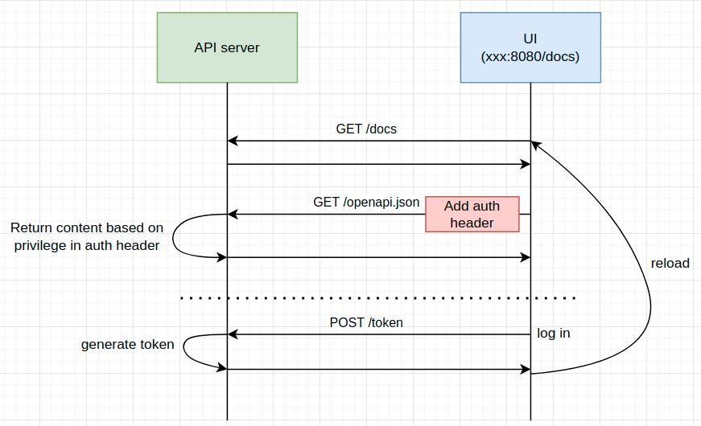

# user-specific-api-doc
Show different RESTful API endpoints for different users in document.

**NOTE: whether an endpoint is accessible to a user still depends on implementation of authentication**

- Framework: FastAPI
- Modification:
    - Disable Redoc
    - Keep swagger html and web components locally (in "static" folder)
    - Use "openapi_extra" to record privilege of endpoints
- Pre-defined users (username/password):
    - general/general
    - admin/admin
    - root/root
- Mechanism:

