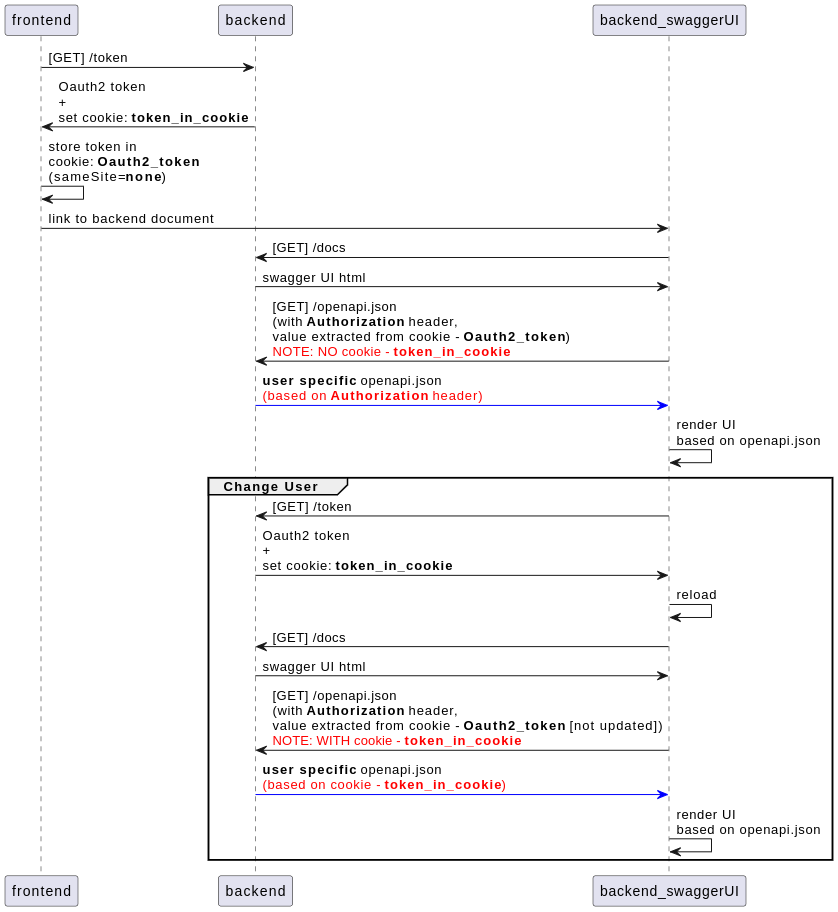

# user-specific-api-doc
Show different API documentation for different users on Swagger UI under FastAPI.

**NOTE: whether an API endpoint is accessible to a user still depends on implementation of authentication on the endpoint**

## 🎯 Features
- [Demonstration of cross-domain auto-authorize swagger UI](#-how-to-demo-run)
- Allow header and cookie Oauth2 authorization (cookie has higher precedence)
- Redoc disabled
- On-premise hosting swagger UI (in `/backend/static` folder)
- Use `openapi_extra` property to document privilege of endpoints
- Pre-defined users (username/password):
    - general/general (lowest)
    - admin/admin
    - root/root (highest)

## 🎬 How to Demo Run
```bash
# terminal 1 (backend runs on 127.0.0.1:9000):
make demo-run-backend

# terminal 2 (frontend runs on 127.0.0.1:8000):
make demo-run-frontend

# browser:
http://127.0.0.1:8000 # frontend UI
```

## 🧩 Mechanism

- 🤔 Why using `cookie` to pass token across site (domain)?
    - Because `localStorage` & `sessionStorage` requires same site (domain), cookie can allow cross site (domain) with `sameSite=none` option.

## 📚 References
- plantUML - sequence diagram: https://plantuml.com/sequence-diagram